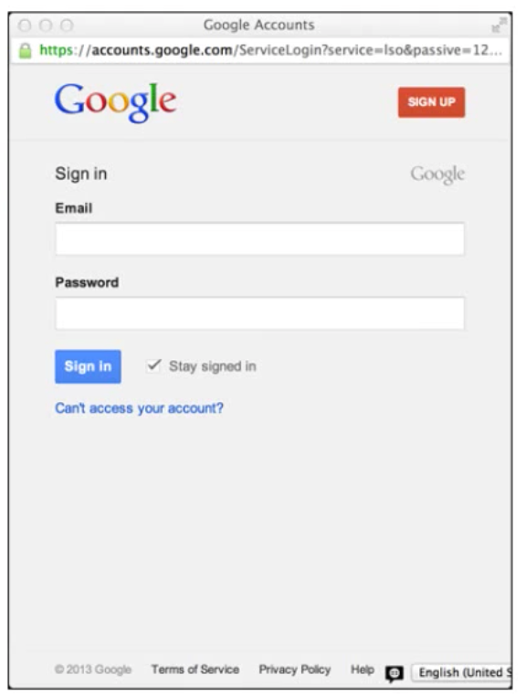

<!-- START doctoc generated TOC please keep comment here to allow auto update -->
<!-- DON'T EDIT THIS SECTION, INSTEAD RE-RUN doctoc TO UPDATE -->
**Table of Contents**  *generated with [DocToc](https://github.com/thlorenz/doctoc)*

- [Introduction to OAuth2, OpenID Connect and JSON Wen Tokens (JWT)](#introduction-to-oauth2-openid-connect-and-json-wen-tokens-jwt)
  - [Secuirty Stack for Modern Applications](#secuirty-stack-for-modern-applications)
    - [OAuth2](#oauth2)
    - [OpenID  Connect](#openid--connect)
  - [JSON Web Token (JWT)](#json-web-token-jwt)
    - [Purpose of Security Tokens](#purpose-of-security-tokens)
    - [JWT Structure and Format](#jwt-structure-and-format)
    - [Producign and Consuming JWTs](#producign-and-consuming-jwts)
  - [Introduction to OAuth2](#introduction-to-oauth2)
    - [History](#history)
    - [OAuth2 Overview](#oauth2-overview)
    - [VAlet Parking Analogy](#valet-parking-analogy)
    - [The Players](#the-players)
    - [OAuth2 Flows](#oauth2-flows)
      - [With User Interaction](#with-user-interaction)
      - [No User Interaction](#no-user-interaction)
  - [OAuth2 Flows](#oauth2-flows-1)
    - [Code Flow: Authorization Request](#code-flow-authorization-request)
    - [Code Flow: Access and Refresh Token](#code-flow-access-and-refresh-token)

<!-- END doctoc generated TOC please keep comment here to allow auto update -->

# Introduction to OAuth2, OpenID Connect and JSON Wen Tokens (JWT)

> My notes from this [Pluralsight course](https://app.pluralsight.com/library/courses/oauth2-json-web-tokens-openid-connect-introduction/table-of-contents)

## Secuirty Stack for Modern Applications

### OAuth2

Delegated authorization. Requesting authorization tokens from a back end service. Token can then be used to talk to a back end service.

### OpenID  Connect

Dealing with authentication.

## JSON Web Token (JWT)

New standard.

### Purpose of Security Tokens

- protected data structures
- contain info about issuer and subject (clais)
- signed (tamper proof, authenticity), signing can be symmetric or asymmetric, client can be assured that token is authentically coming from said issuer therefore can trust token
- usually have expiration time (eg: 10 hours, common in SAML)

**Basic Flow**
- client requests token
- issuer issues token
- resource (typically web API) consumes token (resource has trust relationship with issuer - had some prior key exchange - i.e. consumer knows about key that issuer uses for signing token and can use that key to validate the token)

### JWT Structure and Format

Has two parts:

**Header**
- metadata
- algorithm & keys used for doing cryptographic operations

**Claims**

Claims can either be *reserved* or application-specific, i.e. custom to the application.

Every JWT will have at least these claims:
- Issuer (iss): Recipient knows where token is coming from.
- Audience (aud): Recipient knows they're the intended target to receive this token.
- IssuedAt (iat): Tells recipient when token was issued
- Expiration (exp): Tells recipient when token has expired
- Subject (sub): Identifier of entity that this token describes (eg: user id)

- ... and application defined claims

Notice appreviations for claim types (iss, aud, etc) - idea is to keep JWT as small as possible so it's also good for mobile.

**Structure**

In sample token below, HMAC-SHA256 is used for signing.

```javascript
// Header
{
  "type": "JWT",
  "alg": "HS256"
}
// Claims
{
  "iss": "http://myIssuer",
  "exp": 1340819370,
  "aud": "http://myResource",
  "sub": "alice",

  "client": "xyz",
  "scope": ["read", "search"]
}
```

Expiration is defined in epoch time - number of seconds since Jan. 01, 1970.

`client` claim used for OAuth, indicates which application requested this token.

`scope` also used in OAuth to do authorization (more on this topic later).

**Token is serialized for transmission as follows:**

- Header: Base64 url encoded
- Claims: Base64 url encoded
- Signature: Cnocatenate `Header.Claims` (including dot separator), then run signature algorithm on this string, then Base64 url encode the result.


### Producign and Consuming JWTs

Producing, example for .NET, use Microsoft library on Nuget:

```cs
// generate
var token = new JWTSecurityToken(
  issuer: "http://myIssuer",
  audience: "http://myResource",
  claims: GetClaims(),
  signingCredentials: GetKey(),
  validFrom: DateTime.UtcNow,
  validTo: DateTime.UtcNow.AddHours(1)
);
// serialize
var tokenString = new JWTSecurityTokenHandler().WriteToken(token);
```

Once `tokenString` is generated, it can be sent to client as HTTP request header, query string, cookie etc. JWT spec does not indicate how token should be transmitted.

Consuming example, again .NET:
- Retrieve serialized token (from HTTP header, query string, cookie etc.)
- Validate token, and turn into claims

```cs
var token = new JWTSecurityToken(tokenString);
var validationParams = new TokenValidation Parameters
{
  ValidIssuer = "http://myIssuer",
  AllowedAudience = "http://myResource",
  SigningToken = GetSigningKey()
};

var handler = new JWTSecurityTokenHandler();
// claims principal contains all the claims
var principal = handler.ValidateToken(token, validationParams);
```

## Introduction to OAuth2

Official definition: An open protocol to allow secure authorization in a simple and standard method from web, mobile and desktop applications.

Concerned with controlling access to resources.

### History

- 2007: OAuth started as a way to solve delegation and authorization problems at the time. Google was pushing this protocol forward.
- 2008: IETF normalization
- 2010: RFC 5849 defines OAuth 1.0. Had some weird constraints
  - People that worked on it worked for a company that didn't support SSL -> could not rely on transport protection, therefore built-in heavy crypto to make up for this
  - Designed to work with PHP 4 which had other constraints
  - Ended up more complicated than it's authors wanted
- 2010: WRAP (Web Resource Authorization Profiles) proposed by Micrsoft, Yahoo, Google
  - Extension to OAuth 1.0, attempt to simplify
  - Introduced `Bearer` tokens (more on this later)
- 2010: OAuth 2.0 work begins in IETF: Strong desire to simplify OAuth
- Working deployments of various drafts/versions at Google, Microsoft, Facebook, Github, Twitter, Flickr, Dropbox...
- Mid 2012: Controversy - lead author and editor resigns, withdraws his name from all specs. He wasn't happy with results - too many big companies wanting to be part of standards committee. Resulting in once again more complexity than author wanted, spec becoming too big as each company wanted variations to support their particular use case.
- Oct 2012: RFC 6749, RFC 6750 (describes Bearer token usage). OAuth 2.0 finally signed off (another person took over as lead).

Developed a poor reputation because:
- Took so long to standardize -> bigger companies started development during standardization process but before finialization.
- Final spec had 32 revisions -> ifferent companies implemented it at different revision numbers leading to incompatible implementations.
- Some revisions were not mature wrt security -> eg: Facebook, Twitter, Github got hacked due to immature implementations.

### OAuth2 Overview

Problem: Some human using a desktop or mobile app which needs to access data.


**IMPORTANT:**
Spec distinguishes between *Clients* and *Resource Owners*. In enterprise security, these are the same and both trusted. Now a trusted user (aka Resource Owner) may be running some 3rd party application to access enterprise data, and that app is not necessarily trusted because not developed by the enterprise.

OAuth takes the software (aka Client) that the human uses into account. That software can have different trust levels.

**Client:** The software that is used to access the back end data.

**Resource Owner:** Human that wants to access the resource (akak data) they own (eg: Facebook user wants to check their Timeline.

### VAlet Parking Analogy

Recall Ferris Bueller's Day Off:

- Resource (usually data): Dad's expensive Ferrari
- Resource Owner: Bueller
- Key: Master key to the car, holder of key can do anything - drive any distance, any speed, open trunk, glove compartment etc
- Client (usually software): Valet parking attendant

In the movie, Bueller (resource owner) gives his key to the valet attendant (full trust) to park the car (reource) but he abuses that trust and goes for a joy ride.

Some cars now have a separate valet parking key that provides limited access to the car - can only go a certain distance, unable to unlock trunk etc.

OAuth is about coming up with these sort of keys/tokens that a resource owner can provide to a client, such that the client can access the resource on the resource owner's behalf, but in a limited way. Without the resource owner having to give client the master key (eg: your Facebook password).

### The Players

- Resource Owner: Human that "owns" a resource on *Resource Server*
- Resource Server
- Authorization Server: Software that can issue limited keys
- Client:
  - Trusted: Built by same party that built resource server
  - Partially trusted: Built by a 3rd party
  - Public: Run on devices such as mobile phone, tablet, laptop
  - Confidential: Implemented as server side software, have more control over security.

**Flow**

1. Resource Owner *owns* a resource on a Resource Server.
2. Resource Owner *uses* a Client.
3. Resource Server *trusts* Authorization Server.
4. Client *is registered with* Authorization Server.
5. Authorization Server *authorizes* Client (by providing Client with a limited access key)
6. Client *accesses* Resource Server on behalf of Resource Owner using limited access key provided by Authorization Server.


**Trust Zones**

Tight coupling between Authorization Server and Resource Server. Auth Server knows about resources that owners want protected.

Resource Server knows how to validate the limited access keys coming from Auth server.

Resource Owner and Resource Server also have a trust relationship with each other.

Client is not necessarily part of any trust zone.

### OAuth2 Flows

There are 4 flows - high level overview below, later more detail.

#### With User Interaction

These flows have a human involved to explicitly allow client to access the resource.

Different flows to support working with any type of client.

**Authorization Code Flow**

Built for classical server-side rendered web applications:
1. Request authorization
2. Request token
3. Access resource

**Implicit Flow**

For Native/local (user agent) clients:
1. Request authorization & token
2. Access resource

#### No User Interaction

No separate authorization stage where a human gives conent for a resource to be accessed.

**Resource Owned Password Credential Flow**

Closest to enterprise style software -> clients are trusted, there is no limited access key, only a master key.

Trusted clients
1. Request token with resource owned credentials
2. Access resource

**Client Credential Flow**

Client to Service communication
1. Request token with client credentials
2. Access resource.

## OAuth2 Flows

### Code Flow: Authorization Request

Clients are server rendered web applications. i.e. Resource Owner opens browser to some web app, which needs to access some resource owned by user. But user doesn't want to give this web app their password.

**Steps**

0. Client registers with Authorization Server (one time only, remaining steps happen per request)
1. Authorization Request
2. Authentication (if Resource Owner not already logged in to back end service that has the Resource)
3. Consent
4. Authorization Response
5. Token Request
6. Token Response
7. Resource Access


**Details**

Web Application (Client) will do redirect to Authorization Server:


Redirect follows a specific query string format.

`client_id` Name of c\Client that is trying to access the resource. Clients must already be registered with Authorization Server (effectively Step 0 in the process).

`scope` Indicates which resource Client is trying to access.

`redirect_uri` Client indicates to Authorization Server, when it has finished processing the access request, it should callback the client at the address specified by `redirect_uri`.

`response_type=code` When Authorization Server callsback client at `redirect_uri`, it will include an authorization code.

`state` parameter is optional but highly recommended for cross site requst forgery protection. Random number generated by client and stored locally. When Authorization Server calls back on `redirect_uri`, it should send back that same state value so Client can verify/correlate Authorization Server response with request Client sent previously to request access.

When authorization request reaches Authorization Server, if Resource Owner not already logged in, will be presented with Authentication dialog, eg:



Resource owner must login (aka Authenticate) so that Authorization Server knows who Resource Owner is.

After successful authentication, Consent dialog is presented to Resource Owner, to indicate which client is making this request and what Resource(s) Client is requesting access to.


Twitter combines Authorization and Consent into a single dialog.

Evernote Consent dialog allows Resource Owner to limit access to a period of time such as 1 year.

**Consent screen is very important - put a lot of thought into it!**

If Resource Owner clicks "Allow", Authorization Server will proceed with processing access request.

Authorization Server will callback client, with an *authorization code*, which is not an access token. Because this gets transmitted via User Agent so don't want to leak access token.


Last step is for Client application to communicate directly to Authorization Server to authenticate (exchange credentials that were setup as part of initial registration process). Client app then sends authorization *code* to Authorization Server:


Authorization server will validate request, and if all is valid, sends back token response to Client:


There are two kinds of tokens:

`access_token` Short lived, only good for `expires_in` seconds (1 hour in above example).

`refresh_token` Longer lived, optional. Will be explained later.

Client uses this to access the Resource Server:


### Code Flow: Access and Refresh Token

What does Client do when token expires?